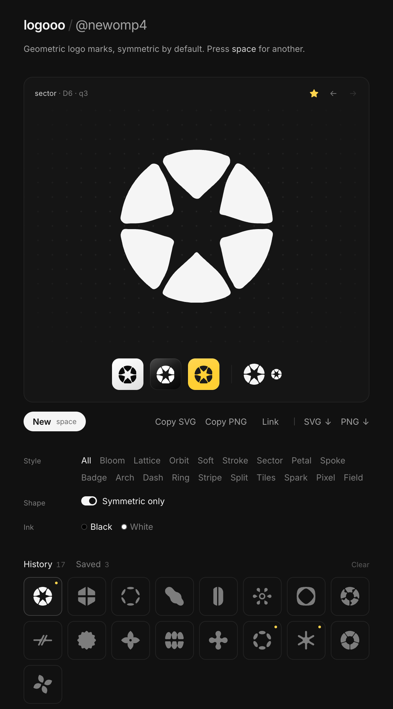

# logooo

Geometric logo marks, symmetric by default. Press space, get a mark, copy it as SVG or PNG.



Marks are built two ways:

- **Booleans:** plain geometry (circles, squircles, concave sparks, grid cells) repeated under a symmetry group (C2, D2, D4, Dn) and combined with paper.js union, subtract and XOR, where overlaps cancel out.
- **Signed distance fields** (`src/gen/sdf.js`): every shape is a "distance to edge" function. Smooth unions give filleted, gooey joins and smooth cuts give soft corners, and the field is traced into a path with marching squares.

Either way the output is a single vector path.

## Styles

| Style | What it makes |
| --- | --- |
| Soft | Rounded, slightly irregular shapes: lobed curves, melted balls, mirrored "characters", lopsided dumbbells |
| Stroke | Monoline strokes with round caps and filleted joins: gooey asterisks, slanted twins, chasing arcs, splats |
| Sector | A ring or polygon cut into radial pieces, optionally twisted, hooked or split by a starburst |
| Petal | Almond leaves or teardrops fanned around a center |
| Spoke | Asterisks and suns from rounded or tapered bars, or flat bars trimmed by a circle |
| Badge | Rounded stars and seals, plain or with an opening |
| Arch | Overlapping ovals whose overlaps cancel, split into two halves |
| Dash | A ring of ellipses, along the ring, across it or tilted |
| Ring | Circle and squircle bands with shaped holes, dots, inner rings and slots |
| Stripe | Circles, squircles, pills and soft shapes sliced into bands, or striped on one side |
| Split | Shapes cut through the middle with the halves slid apart, or quartered |
| Tiles | Bauhaus-style grids of squares, quarter discs, halves, leaves and triangles |
| Bloom | Scalloped frames of overlapping circles with a shaped opening |
| Lattice | Circle grids where overlaps cancel (XOR) or get punched through |
| Orbit | Circles around a center: crescents, bitten moons, chains, rosettes, swirls |
| Spark | Concave four-point stars, mostly cut out of a solid |
| Pixel | Mirror-symmetric bitmaps as sharp blocks, soft blocks or dots |
| Field | Halftone dot fields with radial or diagonal falloff |
| Fan | Tapered rays that shrink as they sweep around (asymmetric mode only) |

### Symmetric only

On by default: every mark has mirror and/or rotational symmetry. Switch it off to also get asymmetric marks (fans, splats) that are balanced instead. Their visual centre of mass has to sit near the middle of the mark.

### Quality checks

Before a mark is shown it has to pass two checks, or it's rerolled:

- **Geometry:** no slivers, no specks, balanced ink coverage, intact symmetry (a failed boolean op breaks it), and nothing as plain as a lone disc or square.
- **Legibility** (`src/gen/legibility.js`): the mark is rasterized at 64px, the way it would appear as an app icon, and scored on ink thinner than ~5% of its size, gaps narrower than that, specks, how many separate pieces and holes the eye would count, and small satellites floating away from the main body. Busy marks score high and get dropped.

### Fewer repeats

Every mark gets a 32×32 silhouette fingerprint. A new mark that overlaps one of your last 40 by 80% or more is swapped for a fresher one, and styles you've just seen are picked less often.

## Use

```sh
npm install
npm run dev
```

| Key | Action |
| --- | --- |
| `space` / `n` | New mark |
| `←` `→` | Browse the open tab (History or Saved) |
| `f` | Save / unsave the current mark |
| `c` | Copy SVG |
| `p` | Copy PNG (1024px, transparent) |
| `l` | Copy a link to the mark |
| `s` | Download SVG |

- **Ink** sets the export colour (black or white).
- **History** keeps the last 240 marks; **Saved** keeps the ones you star. Both live in localStorage.
- **Links:** the URL hash holds the style and seed, so a link like `/#petal.k3j9x2` always rebuilds the same mark (`.x` on the end means asymmetric marks were allowed).
- **Previews:** inside the main card the mark is shown as light, dark and flat-colour app icons, and at 32px and 16px.

## Layout

```
src/
  gen/
    rng.js        seeded PRNG
    geom.js       primitives, symmetry groups, booleans, contour tracing, clean-up and checks
    sdf.js        signed-distance shapes and operations
    legibility.js icon-size raster check, balance check, silhouette fingerprints
    families.js   the styles
    index.js      generate(seed, family)
  export.js       SVG / PNG / clipboard
  palette.js      flat colour pairs for the colour icon
  main.js         UI
scripts/
  sheet.js        [LOOSE=1] node scripts/sheet.js [family|all] [count] [out.html], a contact sheet for tuning
```

Built with [paper.js](http://paperjs.org) for the path booleans and [Vite](https://vite.dev).
